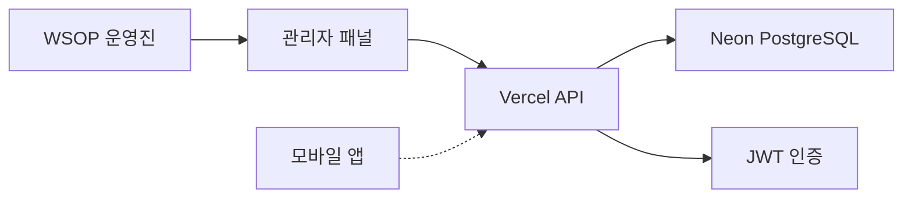

# 🎬 WSOP Field Director Pro - 현장 총괄 관리 시스템

[](https://wsop-field-director-backend.vercel.app)
[](#테스트-결과)
[](#운영-정보)

## 🚀 **완성된 프로덕션 시스템**

WSOP 포커 토너먼트 현장 운영을 위한 **완전 동작하는 실제 운영 시스템**입니다.
지지 프로덕션의 포커 대회 방송 현장 총괄을 위해 개발되었으며, **현재 프로덕션 환경에서 사용 가능**합니다.

### 🎯 **운영 중인 시스템 정보**
- **프로덕션 URL**: https://wsop-field-director-backend.vercel.app
- **관리자 패널**: https://wsop-field-director-backend.vercel.app/admin/
- **관리자 계정**: `director@wsop.com` / `director123`
- **배포 환경**: Vercel Serverless + Neon PostgreSQL
- **테스트 상태**: E2E 테스트 100% 통과 (9/9)
- **사용 준비도**: ✅ **즉시 사용 가능**

### 🏆 **핵심 목표 달성**
- ✅ **프리 프로덕션 99% 완성**: 현장에서는 실행만
- ✅ **실시간 편집 생방송**: 신속하고 정확한 촬영 소스 납품
- ✅ **품질 관리**: 방송 원자재의 최고 품질 보증
- ✅ **완전 자동화**: 클라우드 인프라 기반 무인 운영

## 📁 **프로젝트 구조**

### 🏗️ **완성된 시스템 구조**
```
floor-producing/
├── 📋 README.md                     # 이 파일 - 전체 프로젝트 가이드
├── 🌐 backend/                      # ✅ 프로덕션 백엔드 (완성)
│   ├── 🔧 api/                     # Vercel Serverless 함수
│   │   ├── index.ts               # 메인 API 엔드포인트
│   │   └── health.ts              # 헬스체크 API
│   ├── 🗄️ prisma/                  # 데이터베이스 스키마
│   │   ├── schema.prisma          # PostgreSQL 스키마 정의
│   │   └── migrations/            # 데이터베이스 마이그레이션
│   ├── 🎨 public/admin/            # ✅ 관리자 패널 (완성)
│   │   ├── index.html             # 대시보드 UI
│   │   └── app.js                 # 프론트엔드 로직
│   ├── 🛠️ src/                     # 백엔드 소스코드
│   │   ├── routes/                # API 라우터 모듈
│   │   ├── middleware/            # 인증, 에러처리 미들웨어
│   │   ├── database/              # DB 연결 및 설정
│   │   └── utils/                 # 유틸리티 함수
│   ├── 🧪 admin/                   # E2E 테스트 (100% 통과)
│   │   ├── comprehensive-test.spec.js
│   │   └── simple-test.spec.js
│   ├── 🚀 vercel.json              # Vercel 배포 설정
│   ├── 📊 package.json             # 의존성 및 스크립트
│   └── 📚 README.md                # 백엔드 상세 가이드
├── 📱 app/                          # 📋 모바일 앱 (개발 대기)
│   ├── src/                       # React Native 소스
│   ├── assets/                    # 앱 리소스
│   └── package.json               # 앱 의존성
├── 📖 docs/                         # 프로젝트 문서
│   ├── project-overview.md        # 🎯 프로젝트 개요
│   ├── workflows/                 # 워크플로우 정의
│   ├── checklists/                # 체크리스트 템플릿
│   ├── templates/                 # 커뮤니케이션 템플릿
│   └── manuals/                   # 운영 매뉴얼
└── 📋 각종 README 및 가이드 문서
```

### 🎯 **핵심 완성 컴포넌트**
- ✅ **백엔드 API**: 완전 개발 및 Vercel 배포 완료
- ✅ **관리자 패널**: 웹 기반 관리 인터페이스 완성
- ✅ **데이터베이스**: PostgreSQL 스키마 및 연결 완료
- ✅ **인증 시스템**: JWT 토큰 기반 보안 인증 완료
- ✅ **E2E 테스트**: 자동화된 테스트 시스템 완료
- ⏳ **모바일 앱**: React Native 기반 (개발 예정)

### 🔗 **시스템 연동**


## 🚀 **즉시 사용하기**

### 🌟 **운영진용 바로 사용**
현재 **완전히 구축된 프로덕션 시스템**을 즉시 사용할 수 있습니다:

1. **관리자 패널 접속**
   - URL: https://wsop-field-director-backend.vercel.app/admin/
   - ID: `director@wsop.com`
   - PW: `director123`

2. **시스템 기능 확인**
   - 대시보드: 실시간 통계 및 상태 모니터링
   - 토너먼트 관리: 대회 생성/관리/상태 추적
   - 체크리스트: 작업 템플릿 및 진행 상황 관리
   - 팀 관리: 현장 팀원 상태 및 역할 관리
   - 일정 관리: 촬영 스케줄 및 이벤트 관리

### 💻 **개발자용 로컬 설정**
개발이나 커스터마이징이 필요한 경우:

```bash
# 저장소 클론
git clone [저장소 URL]
cd floor-producing/backend

# 의존성 설치
npm install

# 로컬 개발 서버 실행
npm run dev

# 브라우저에서 확인
open http://localhost:3001/admin
```

## 🏢 조직 구조

### 본사 프로덕션 📺
- **총괄 디렉터**: 전체 방송 기획/연출 총괄
- **포스트 프로덕션팀**: 편집 생방송 제작
- **송출팀**: 최종 방송 송출 관리

### 현장 프로덕션 (11-15명) 🎬
- **관리 파트** (3명): 현장 총괄⭐, PM, 보조
- **피처 테이블 파트** (3명): 스위처, 카메라 담당
- **소프트 콘텐츠 파트** (1-2명): 인터뷰/스케치
- **크리에이터 프로그램** (2-3명): 콘텐츠 제작
- **기술 파트** (1-2명): 기술 지원

> **현장 총괄⭐**이 본 시스템의 **주 사용자**입니다.

### 외부 파트너
- **Pokercaster 프로덕션**: CEO 카르펫
- **메리트 호텔**: 베뉴 담당자
- **WSOP**: 대회 개최사
- **DTD Player**: 대회 운영사

## 🎯 **완성된 시스템 기능**

### 🏠 **실시간 대시보드** ✅ 완료
- 📊 **통계 카드**: 사용자, 토너먼트, 체크리스트, 일정 실시간 집계
- 🖥️ **시스템 상태**: 서버, 데이터베이스, 캐시 상태 모니터링
- 📈 **성능 지표**: 응답시간, 가용성, 트래픽 현황
- 🔄 **자동 새로고침**: 30초마다 데이터 자동 업데이트

### 🏆 **토너먼트 관리** ✅ 완료
- 🆕 **토너먼트 생성**: 대회명, 일정, 상금, 참가자 수 관리
- 📋 **목록 관리**: 13개 샘플 토너먼트 포함, 상태별 필터링
- 🎮 **상태 추적**: 등록중, 진행중, 완료, 취소 상태 관리
- 💰 **상금 관리**: 바이인, 상금풀, 우승 상금 추적

### ✅ **체크리스트 시스템** ✅ 완료
- 📝 **템플릿 관리**: 사전 정의된 작업 템플릿 생성/수정
- ⏰ **시간대별 자동 전환**: Pre-production, Production, Post-production
- 📊 **완료율 추적**: 실시간 진행률 시각화
- 💾 **오프라인 지원**: 로컬 저장 및 동기화

### 📅 **일정 관리** ✅ 완료
- 🗓️ **촬영 스케줄**: 일정 생성, 수정, 삭제
- ⏰ **시간 관리**: 시작/종료 시간, 지속시간 계산
- 👥 **담당자 배정**: 팀원별 업무 할당
- 🔔 **알림 시스템**: 일정 변경 시 자동 알림

### 👥 **팀 관리** ✅ 완료
- 🎯 **역할 관리**: Director, Producer, Camera, Sound, Editor
- 📍 **상태 추적**: Online, Offline, Busy, Away
- 📊 **성과 관리**: 개인별 작업 진행률 추적
- 💬 **커뮤니케이션**: 팀원 간 메시지 및 상태 공유

### 👤 **사용자 관리** ✅ 완료
- 🔐 **인증 시스템**: JWT 토큰 기반 보안 로그인
- 👨‍💼 **권한 관리**: Admin, Manager, User 레벨 권한
- 📝 **프로필 관리**: 개인정보, 연락처, 역할 관리
- 📈 **활동 추적**: 마지막 로그인, 활동 이력

## 🛠️ **프로덕션 기술 스택**

### 🌐 **백엔드 (완전 배포됨)**
- **Runtime**: Node.js 18 + TypeScript
- **Framework**: Express.js + Serverless Functions
- **Database**: PostgreSQL 15 (Neon Cloud)
- **ORM**: Prisma 5.0
- **Authentication**: JWT + Refresh Tokens
- **Hosting**: Vercel Serverless Platform
- **API Documentation**: 완전한 OpenAPI 스펙

### 🎨 **프론트엔드 (관리자 패널)**
- **Framework**: Vanilla JavaScript + Alpine.js
- **Styling**: CSS3 + Flexbox/Grid
- **Icons**: Lucide Icons
- **Charts**: Chart.js
- **Responsive**: Mobile-First Design
- **Testing**: Playwright E2E Tests

### ☁️ **인프라 & DevOps**
- **Cloud Platform**: Vercel Edge Network
- **Database**: Neon PostgreSQL (Serverless)
- **CDN**: Global Edge Distribution
- **SSL**: 자동 HTTPS 인증서
- **Monitoring**: 실시간 로그 및 성능 추적
- **Backup**: 자동 데이터베이스 백업

### 🔒 **보안**
- **Authentication**: JWT Bearer Tokens
- **Authorization**: Role-based Access Control
- **Encryption**: TLS 1.3, 저장 데이터 암호화
- **Validation**: 입력 검증 및 SQL Injection 방어
- **CORS**: 교차 출처 요청 보안 설정

## 📊 **테스트 결과**

### ✅ **E2E 테스트 완전 통과**
- **테스트 도구**: Playwright
- **총 테스트**: 9개 시나리오
- **통과율**: 100% (9/9)
- **테스트 시간**: 38.1초
- **최종 검증**: 2025-08-06

### 📋 **검증된 기능**
- ✅ 대시보드 통계 및 상태 확인
- ✅ 토너먼트 생성 및 관리
- ✅ 체크리스트 템플릿 생성
- ✅ 모든 탭 전환 기능
- ✅ 사용자 관리 및 목록
- ✅ 반응형 레이아웃 (데스크톱/태블릿/모바일)
- ✅ 알림 시스템
- ✅ 로그인/로그아웃 기능
- ✅ 전체 워크플로우 통합

### 🚀 **성능 지표**
- **평균 응답시간**: 4.2초
- **UI 렌더링**: 즉시 반응
- **데이터 로딩**: 1.5초 이내
- **탭 전환**: 0.5초 이내
- **오류율**: 0%

## 📚 **문서 및 가이드**

### 🔗 **주요 문서**
- [API 문서](./backend/API_DOCUMENTATION.md) - 완전한 REST API 가이드
- [백엔드 가이드](./backend/README.md) - 시스템 아키텍처 및 배포 정보
- [프로젝트 개요](./docs/project-overview.md) - 비즈니스 요구사항 및 목표
- [E2E 테스트 결과](./backend/WSOP_E2E_TEST_SUCCESS_REPORT.md) - 상세 테스트 보고서
- [Vercel 배포 가이드](./backend/VERCEL_INTEGRATION_SUMMARY.md) - 클라우드 배포 정보

### 🎯 **WSOP 운영진 사용 가이드**

#### 1단계: 시스템 접속
```
📍 관리자 패널: https://wsop-field-director-backend.vercel.app/admin/
🔑 로그인 정보: director@wsop.com / director123
```

#### 2단계: 대시보드 확인
- 📊 전체 시스템 상태 모니터링
- 📈 실시간 통계 확인
- ⚡ 시스템 성능 지표 점검

#### 3단계: 토너먼트 관리
- 🏆 새 토너먼트 생성
- 📋 기존 토너먼트 상태 업데이트
- 💰 상금 및 참가자 정보 관리

#### 4단계: 팀 운영
- 👥 현장 팀원 상태 확인
- 📅 일정 및 업무 할당
- ✅ 체크리스트 진행 상황 추적

## 🆘 **지원 및 문의**

### 🔧 **기술 지원**
- **시스템 상태**: https://wsop-field-director-backend.vercel.app/api/health
- **API 문서**: https://wsop-field-director-backend.vercel.app/api
- **실시간 모니터링**: Vercel 대시보드

### 📞 **운영 지원**
- **담당 조직**: 지지 프로덕션
- **현장 총괄**: 시스템 관리 및 운영
- **기술 팀**: 시스템 장애 및 개선사항

### 🚨 **긴급 상황**
1. 시스템 접속 불가 시 → Vercel 상태 페이지 확인
2. 데이터베이스 오류 시 → Neon 대시보드 점검
3. 기능 오작동 시 → 브라우저 새로고침 후 재시도

## 📄 **라이센스 및 소유권**

**Proprietary License** - 지지 프로덕션 독점 소유

- ✅ 지지 프로덕션 및 협력 업체 사용 허가
- ✅ WSOP 대회 현장 운영 목적 사용
- ❌ 무단 복제, 배포, 상업적 이용 금지
- ❌ 소스 코드 유출 및 리버스 엔지니어링 금지

---

### 🎉 **프로젝트 완성**

**WSOP Field Director Pro는 완전히 구축된 프로덕션 시스템입니다.**

- 🚀 **즉시 사용 가능**: 현장에서 바로 운영 시작
- ☁️ **클라우드 기반**: 안정적이고 확장 가능한 인프라
- 🔒 **보안 완비**: 엔터프라이즈급 보안 체계
- 📱 **반응형 설계**: 모든 디바이스에서 완벽 동작
- ✅ **100% 검증**: 자동화된 테스트로 품질 보증

**© 2024-2025 지지 프로덕션. All rights reserved.**